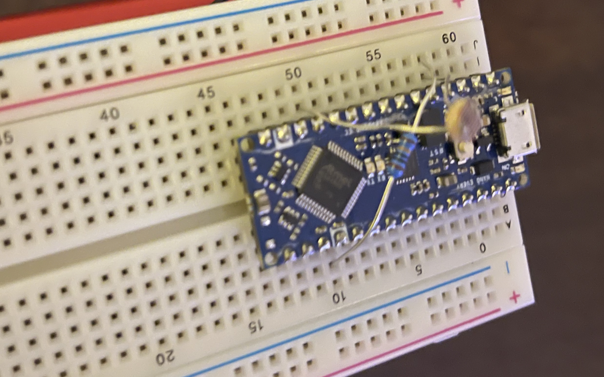
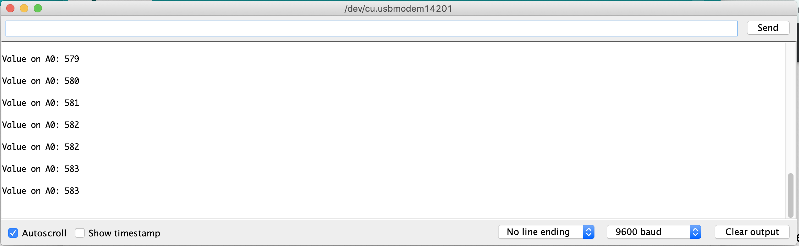
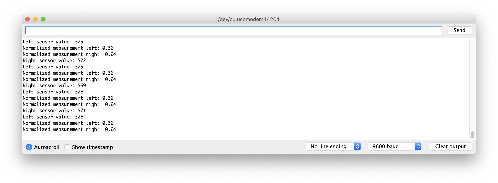
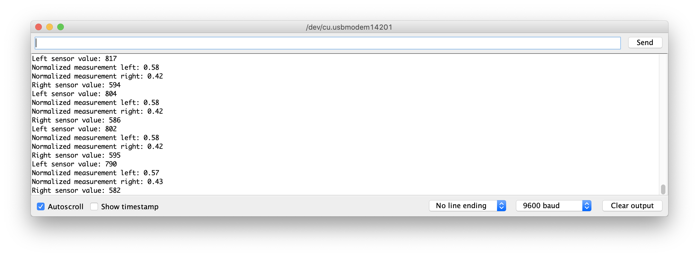

# Aditi Agarwal ECE 3400 SP 21

This is Aditi Agarwal's (aa2224) Wiki Page for ECE 3400 SP 21. 

## Table of Contents
- [Lab 1](#Lab 1)
- [Lab 2](#Lab 2)

## Lab 1

In Lab 1, I learned how to program the Arduino, how to assemble a circuit with photoresistors, and how to view the input of photoresistors through using Arduino pins. 

### Blinking the LED

As an introduction to programming an Arduino, the first task of the lab was to blink an LED. After installing the Arduino IDE, I used the file given to us, `blink_LED.ino`. This code helped me learn how programming a microcontroller works, in which there is a setup sequence, and then a loop that continuosly runs on the Arduino everytime it is turned on until a new program gets loaded onto the Arduino or you press the RESET button. In the setup part of the code, the `LEDBUILTIN` pin, which is a "pin" that controls the LED that is already on the Arduino, is declared as an output so that the compiler can tell the Arduino that it is writing values to it to output onto the connected I/O device, which in this case is the built-in LED. In the loop part of the code, we first write a `HIGH` signal to the LED, which is a digital value that is high enough power to turn on the LED, then there is a delay, then we write `LOW` which turns the LED off, and then there is another delay. The delay between the writes to the LEDs is required in order to see any visible change since the clock speed of the Arduino is faster than we can see. After understanding how the code works, I programmed it to the Arduino, and saw that how I changed the delay time affected how fast the LED was blinking. 

### Building the Photosensor Circuits

After understanding how to program the Arduino, we got started on the first part of developing a Light Following robot. To get the Light Following Robot to follow light, I first needed to connect the photoresistors to the Arduino to sense light intensity. The CdS Photosensors are photoresistors in which as more light is detected (indcident light) at the sensor, the resistance value decreases so that the output voltage increases. This is because the photoresistor is a voltage divider circuit with the resistor that has incident light is on one side and a 10 kilo-ohms pull-down resistor is on the other side. The output voltage is connected to an analog input of the Arduino Nano so that its value can be read (from 0 to 1023) by the Arduino as a digital value. 

 Since it reads a value upto 1023, it was important to first calibrate the photoresistor to the regular lighting surroundings so that it will be able to detect a flashlight approximiatley 30 cm away. To do this, I first created a simple circuit with just one photosensor connected. 
 

After creating this circuit, I used the `CdS_ReadA0.ino` code to read the value to the Serial Monitor. In the code, first in set up I set the baud rate to 9600 and then match that on the serial monitor so that I can read the outputs. Then in the loop, I read the pinvalue using an `analogRead` to pin A0, which is which pin the photoresistor output is. Below is what got printed out on the serial monitor without a flashlight near it, so it is the value based on just surrounding light.

After callibrating with one photosensor, I created a circuit with two photosensors, one pointing to the left and one to the right of the robot so that it will turn to the right or left based on where the flashlight is. I used two analog pins, A0 and A1 for the output of the photoresistors. The full circuit below. 

To detect which side the flashlight is, I used a Normalized Measurement for the left and the right. This is needed because if the flashlight was on the right, for example, the left would still detect it. The normalized measurement for the left is the sensor reading on the left divided by the sum of both sensor readings and the normalized measurement for the right is the sensor reading on the right divided by the sum of both sensors. I wrote the code `CdS_ReadA0A1.ino` so that it prints the normalized measurement values on both the left and right side. This is the first step to eventually making the robot follow light.

Serial Output when flashlight is on the right:

Serial Output when flashlight is on the left:

In Lab 2, I will connect the motors to the circuit and write code so that the robot moves based on the light.
 

## Lab 2

In this lab, I integrated the work from Lab 1 where I callibrated and created the circuits for the photoresistors with the actual motors and wheels to fully create a light following robot. 

### Analog-to-Digital Conversion on Arduino

In order to read voltage values, the Arduino is able to convert an Analog input into a digital reading from 0 to 1023. 

In this lab, we had to examine the timing of the ADC process as we use it to read the photoresistor values for light following. The CLK_ADC value generates a clock signal as described by the following table from the ATMega4809 Datasheet. 

Using the bitRead() function and from reading the ATMega Datasheet for the correct bits to access, I was able to access the prescalar and PDIV values from the ADC0 CTRLC and CLKCTRL MCLKCTRLB registers respectively. The CLK_ADC values is generated from the CLK_PER value which is the CPU clock divided down by the prescaler value that is accessed in the CTRLC register in ADC0. 

The prescalar value of 6 means that the prescalar is 128. There is also the PDIV value which is either enabled or un-enabled for use to futher divide the CLK_PER value by. 

Since the PDIV was not enabled (PEN = 0), it was not factored into the CLK_ADC value.

The CLK_ADC is hence 16 MHz / 128 = 125 kHz

### H-Bridge

To run the robot's motors, we used an H-Bridge. We were given a chip for the H-Bridge (L293D). To power and control the motors, we used the following pinout from Lecture 7.

The internal logic for the L293D chip to work requires 5V from the Arduino and the motors use the 4.5V AA Battery pack. I connected Arduino output pins to the enables for the 2 motors to control the speed and then digital connections to the motor. 

The chip at the bottom of the image (back of the robot) is the L293D chip.

To send a digital signal that can control power, the Arduino uses Pulse Width Modulation (PWM). PWM works by sending either a high or low signal, but in different time intervals. The longer the high signal is in each cycle, the higher the voltage is. 

I used 2 Arduino digital pins with PWM for the enables for each motor to control the speed. The other outputs for the direction did not need to be connected to PWM pins because they were either just high or low. To show wheel actuation, I first just made the robot's wheels move forward together, move backward together, turn in opposite direction to each other, and then come to a full stop. Each of these are for one second until the stop. To get the timing accurate, I used a millisecond timer and compared the time in the loop to 0 to switch to the different wheel directions based on time. 

https://user-images.githubusercontent.com/45053255/112901371-ad3d8280-90b2-11eb-96fa-8a2b6565c5f5.mov

<figure class="video_container">
  <iframe src="https://drive.google.com/file/d/1U6MJ6ScXGQpIi-ZrKf22N5cd0a4_htNr/view?usp=sharing" frameborder="0" allowfullscreen="true"> </iframe>
</figure>

